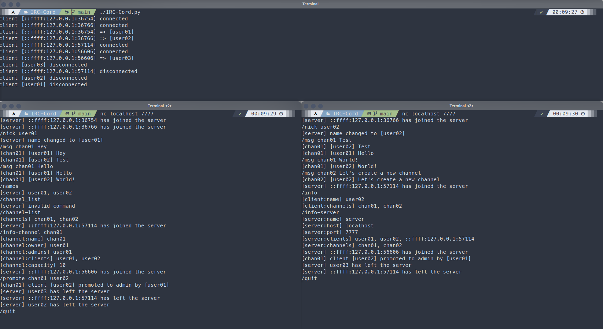

# IRC-Cord - Discord IRC Chat

[](https://github.com/TLacault/IRC-Cord)

## About the Project
- **Discord-like IRC Chat** implemented in Python, implementing features such as servers, channels, and multiple commands.
- Object-Oriented Programming, using TCP/IP protocol for communication.

## Technologies & Tools

[](https://www.python.org/) [](https://en.wikipedia.org/wiki/Internet_protocol_suite)

[](https://code.visualstudio.com/) [](https://git-scm.com/) [](https://github.com/) [](https://www.linux.org/)


## Features

- Server Management: Create, join, and manage servers.
- Channel Management: Create, join, and manage channels within servers.
- User Management: Register users, set permissions, and manage user roles.
- Messaging: Send and receive messages in real-time within channels.
- Command Handling: Execute various commands to perform actions within the application.

## Under Construction 🚧
- [x] Server Management
- [x] Channel Management
- [x] User Management
- [x] Messaging
- [x] Command Handling
- [x] User Roles
- [ ] User Authentication
- [ ] User Permissions
- [ ] User Profile

## Installation

* **Clone with HTML**

```
git clone https://github.com/TLacault/IRC-Cord.git
```

* **Clone with SSH**

```
git clone git@github.com:TLacault/IRC-Cord.git
```

# Usage

* **Start the server by running IRC-Cord.py** :
```
./IRC-Cord.py
```

* **Open a terminal and connect as many clients as you want**
```
nc localhost 7777
```
> Port Configuration ans external connexions will come soon